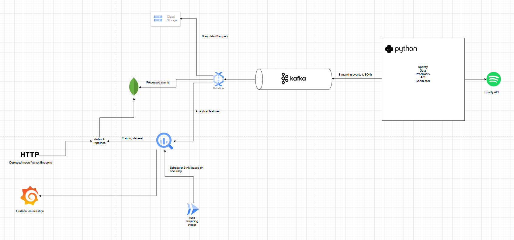

# **Caso de Estudio: Spotify MLOps – Predicción de Popularidad Musical en Tiempo Real**

---

## **Integrantes**

Andrés Leonardo Rojas Peña – alrojasp@eafit.edu.co
Daniel Pineda Velez - Dpinedav@eafit.edu.co
## **Descripción del Caso de Negocio**

El presente caso de estudio tiene como objetivo **predecir el nivel de popularidad de una canción (Alta, Media o Baja)** en tiempo real, a partir del comportamiento de usuarios dentro de la plataforma Spotify.  

El modelo analiza cómo varía la popularidad según el **país**, la **hora del día** y el **tipo de evento** (por ejemplo, búsquedas, reproducciones o skips).  
De esta forma, se busca anticipar qué canciones podrían volverse más escuchadas en determinados momentos o regiones, lo cual tiene aplicación directa en la **curaduría musical**, **marketing digital** y **recomendación personalizada**.

---

## **Descripción del Caso Tecnológico**

El caso se implementa como una solución **end-to-end** en **Google Cloud Platform (GCP)**, con arquitectura **Kappa**, integrando componentes de **streaming, almacenamiento, machine learning y visualización**.

**Flujo general:**
1. **Ingesta:** los eventos de la API de Spotify se publican en **Kafka**.  
2. **Procesamiento:** un pipeline en **Apache Beam (Dataflow)** transforma los mensajes y los envía a **BigQuery**, **MongoDB Atlas** y **Google Cloud Storage**.  
3. **Analítica:** los datos almacenados en BigQuery se utilizan para entrenar un modelo predictivo en **Vertex AI**, que estima la popularidad de cada canción.  
4. **Despliegue:** el modelo se publica como un **endpoint de predicción** en Vertex AI.  
5. **Visualización:** los resultados se almacenan en **BigQuery** y se presentan en tiempo real mediante **Grafana**.

**Variables de entrada:**
- `hour_of_day` → hora del evento.  
- `event_type_search_result` → tipo de interacción del usuario.  
- `country_CO`, `country_ES`, `country_MX`, `country_US` → país del usuario (codificación one-hot).  

**Variable objetivo:**  
- `popularity_level` → nivel de popularidad de la canción (**Alta**, **Media** o **Baja**).

---

## **Metodología Analítica**

Se utilizó la metodología **CRISP-DM**, aplicada al flujo MLOps del proyecto:

1. **Comprensión del Negocio:** definir cómo la hora, país y tipo de interacción influyen en la popularidad musical.  
2. **Comprensión de los Datos:** análisis exploratorio de los eventos históricos en BigQuery.  
3. **Preparación de los Datos:** transformación y normalización mediante Apache Beam.  
4. **Modelado:** construcción y entrenamiento de un modelo de clasificación en **Vertex AI Training**.  
5. **Evaluación:** cálculo de métricas (accuracy y F1-score) para validar el desempeño del modelo.  
6. **Despliegue:** publicación del modelo y consumo del endpoint para predicciones automáticas en streaming.

---

## ☁️ **Arquitectura de Referencia**

La arquitectura sigue el patrón **Kappa Architecture**, con servicios administrados en Google Cloud:

**Servicios involucrados:**
- **Kafka:** ingesta en streaming  
- **Dataflow:** procesamiento en tiempo real  
- **BigQuery:** almacenamiento analítico y consultas SQL  
- **MongoDB Atlas:** base NoSQL para eventos crudos  
- **Cloud Storage:** respaldo batch y datasets  
- **Vertex AI:** entrenamiento, registro y despliegue del modelo  
- **Grafana:** visualización en tiempo real de resultados  

---

## **Implementación del Caso de Estudio**

**En este REPO de GITHUB**

## **Documentación del caso**

En el README llamado **README_TECNICO.md**

## 📘 **Conclusión**

El proyecto **Spotify MLOps** demuestra la integración completa de un flujo de **analítica avanzada en streaming con MLOps**, cumpliendo los principios de escalabilidad, automatización y análisis en tiempo real.  
La solución permite anticipar comportamientos de popularidad musical y ejemplifica el uso práctico de arquitecturas **Kappa** en **entornos de datos intensivos**.
